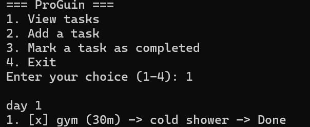
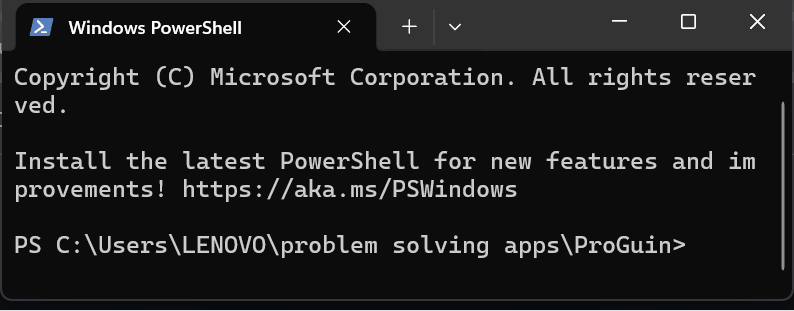

# ProGuin

[](https://github.com/Venkateshx7/ProGuin/graphs/contributors) [](https://github.com/Venkateshx7/ProGuin/network/members) [](https://github.com/Venkateshx7/ProGuin/stargazers) [](https://github.com/Venkateshx7/ProGuin/issues) [](https://github.com/Venkateshx7/ProGuin/blob/main/LICENSE)

## 👤 Author

**Venkatesh D** - Creator & maintainer of ProGuin

## About The Project

ProGuin is a productivity system.

This is not just a todo-list app. ProGuin is a growing experiment that combines ideas from multiple productivity philosophies and books, starting from a simple CLI-based foundation and evolving step by step.

The goal is to build a system that:

-   Encourages consistency over motivation
-   Rewards completion, not planning
-   Works across CLI, desktop, and mobile in the future

This repository represents the beginning.

## 📸 Screenshot


---

## 🎥 Demo



### Built With

ProGuin currently uses only Python standard library modules. No external packages are required.

---

## Philosophy

-   Discipline over motivation
-   Do hard work first, reward later
-   Time-bound focus
-   Simple daily structure

## What ProGuin is NOT

-   Not a fancy todo app
-   Not a motivational quote generator
-   Not overwhelming

---

## Current Features

-   Task-based daily planning
-   Time-bound tasks
-   Rewards for completion
-   Persistent data (JSON)

---

## Roadmap

-   Interactive CLI menu (v0.2.0)
-   Packaging improvements (v0.3.0)
-   Focus timers
-   Auto-run daily schedule
-   Desktop/mobile versions (future)

See the [open issues](https://github.com/Venkateshx7/ProGuin/issues) for a list of proposed features (and known issues).

---

## Getting Started

### Prerequisites

-   Python 3.8+

### Installation

**Option 1 — Install locally (recommended)**

```bash
pip install -e .
proguin
```

**Option 2 — Run directly**

```bash
python -m proguin.cli
```

## How to Run

Use this space to show useful examples of how a project can be used. Additional screenshots, code examples and demos work well in this space. You may also link to more resources.

### Demo

```text
Enter page title: My Day
Enter task name: Learn Python
Do you wants a timer in minutes? (y/n): y
Enter timer_minutes: 30
Do you wants a reward? (y/n): n

started_at: 2026-01-25T15:21:51
ends_at: 2026-01-25T15:51:51
timer_minutes: 30
My Day
1 . [ ] Learn Python (30m)  -> Not Done
```

#### CLI Menu (v0.2.0)

1.  View tasks
2.  Add a task
3.  Mark a task as completed
4.  Exit

## Data Storage

Tasks are stored locally in:

`data/page.json`

## Contributing

Contributions are welcome! Please read [CONTRIBUTING.md](CONTRIBUTING.md) for details on our code of conduct and the process for submitting pull requests.

1.  Fork the Project
2.  Create your Feature Branch (`git checkout -b feature/AmazingFeature`)
3.  Commit your Changes (`git commit -m 'Add some AmazingFeature'`)
4.  Push to the Branch (`git push origin feature/AmazingFeature`)
5.  Open a Pull Request

## License

MIT License

Distributed under the [MIT License](LICENSE). See `LICENSE.txt` for more information.

## Contact

Venkatesh D - [u/InitiativeQuiet6916](https://www.reddit.com/user/InitiativeQuiet6916/) - [venkatesh.devarajan307@gmail.com](mailto:venkatesh.devarajan307@gmail.com)

Project Link: [https://github.com/Venkateshx7/ProGuin.git](https://github.com/Venkateshx7/ProGuin.git)

## Acknowledgments

-   All Contributors to ProGuin
-   [Img Shields](https://shields.io)
-   [Choose an Open Source License](https://choosealicense.com)
-   [Font Awesome](https://fontawesome.com)

⭐ If you find ProGuin useful, consider giving it a star.
